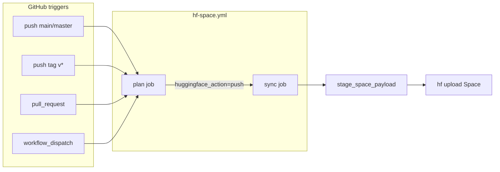

# feat: HF Space auto-deploy on default branch and release tags

## Summary

Extend the existing `hf-space.yml` release workflow so Hugging Face Space uploads happen automatically on merge to the default branch **and** on `v*` release tags, using the staged minimal payload path (`hf_space_sync.py --execute`). Retire the duplicate legacy full-repo mirror workflow as the default path and document the contract in release automation docs.

---

## Problem Frame

The repo already auto-syncs HF Space on push to `main`/`master` via `.github/workflows/hf-space.yml` when `HF_TOKEN` is configured, but **release tag pushes do not trigger a Space upload**. A second workflow (`sync-hf-space.yml`) mirrors the full repo and is gated behind `HF_SPACE_AUTO_SYNC=true`, creating two competing deploy paths with different payload hygiene. Users expect "ship to default branch or cut a release" to keep the live Space current without manual `hf upload`.

---

## Requirements

- R1. Push to default branch (`main`/`master`) continues to trigger staged HF Space upload when `HF_TOKEN` is present and HF target is enabled
- R2. Push of `v*` release tags triggers the same staged HF Space upload path
- R3. Pull requests remain plan-only (no Space mutation)
- R4. Single authoritative workflow path — staged minimal payload via `scripts/hf_space_sync.py`, not full-repo mirror by default
- R5. `docs/knowledgebase/release-automation.md` documents branch + tag triggers and required secrets
- R6. Tests cover tag-trigger release plan behavior where applicable

---

## Scope Boundaries

- Hosted browser E2E after deploy (P10) — deferred to plan 005; this plan wires CI upload only
- Hunyuan adapter enablement — out of scope
- Changing Space SDK or runtime generation logic — out of scope

### Deferred to Follow-Up Work

- Post-deploy smoke job that opens live Space and runs Block/Vase (plan 005 U3)
- Bumping GitHub Actions to Node 24–compatible action versions (non-blocking deprecation warnings)

---

## Context & Research

### Relevant Code and Patterns

- `.github/workflows/hf-space.yml` — plan + sync jobs; sync gated on `huggingface_action == 'push'`
- `.github/workflows/sync-hf-space.yml` — legacy `huggingface/hub-sync` full mirror; opt-in via repo variable
- `.github/workflows/release.yml` — `v*` tags publish Python dist only
- `scripts/hf_space_sync.py` — stages minimal payload, runs `hf upload` with delete patterns
- `src/imageezgen3d/release_plan.py` — `huggingface` target uses same enablement as other forges
- `docs/knowledgebase/release-automation.md` — documents workflow split
- `docs/knowledgebase/deployment-hf-cli.md` — staged upload runbook

### External References

- Hugging Face Hub CLI `hf upload` for Spaces (`--repo-type=space`)
- GitHub Actions `on.push.tags` for release triggers
- `[OFFICIAL]` Spaces build installs `requirements.txt` before copying source

---

## Key Technical Decisions

- **Extend `hf-space.yml` with tag triggers** rather than adding HF steps to `release.yml`: keeps one Space workflow, reuses plan/sync jobs and `release_workflow_outputs.py`
- **Keep staged minimal payload** as the only automatic path: aligns with AGENTS.md Space payload hygiene and avoids full-repo timeout/junk uploads
- **Disable or remove automatic path from `sync-hf-space.yml`**: mark as manual-only dispatch to prevent dual deploys; do not delete dispatch escape hatch without documenting migration
- **Tag pushes use same `huggingface_action` gate**: credentials + enabled target; commit message should include tag name for traceability

---

## Open Questions

### Resolved During Planning

- Should releases use a separate Space? **No** — same Space, tag-named commit message for audit trail
- Should `release.yml` call HF sync? **No** — tag trigger on `hf-space.yml` is cleaner

### Deferred to Implementation

- Whether to add `workflow_call` from `release.yml` if tag-only workflows need ordering with dist publish

---

## High-Level Technical Design

> *Directional guidance for review, not implementation specification.*

---

## Implementation Units

- U1. **Add release tag triggers to HF Space workflow**

**Goal:** Run plan/sync on `v*` tag pushes.

**Requirements:** R2

**Dependencies:** None

**Files:**
- Modify: `.github/workflows/hf-space.yml`

**Approach:**
- Add `push.tags: ['v*']` alongside existing branch triggers
- Ensure concurrency group handles tags (`github.ref` differs per tag)

**Test scenarios:**
- Test expectation: none — workflow YAML; validated by release plan tests + manual/tag dry-run summary

**Verification:**
- Workflow file lists both branch and tag push triggers

---

- U2. **Tag-aware commit message in hf_space_sync**

**Goal:** Space commits from tag builds are identifiable in HF history.

**Requirements:** R2

**Dependencies:** U1

**Files:**
- Modify: `scripts/hf_space_sync.py`
- Test: `tests/test_hf_space_sync.py` (create if missing) or extend existing HF CLI tests

**Approach:**
- When `GITHUB_REF` starts with `refs/tags/`, use commit message like `Deploy ImageEZGen3D v1.2.3`

**Test scenarios:**
- Happy path: tag ref produces tag in commit message string
- Happy path: branch ref keeps default message

**Verification:**
- Unit test passes; dry-run command output includes expected message

---

- U3. **Consolidate legacy sync workflow**

**Goal:** One automatic deploy path.

**Requirements:** R4

**Dependencies:** U1

**Files:**
- Modify: `.github/workflows/sync-hf-space.yml`
- Modify: `docs/knowledgebase/release-automation.md`

**Approach:**
- Remove `push: branches: main` trigger from `sync-hf-space.yml` (keep `workflow_dispatch` only)
- Document that `hf-space.yml` is the automatic path; `sync-hf-space.yml` is emergency full-mirror manual tool

**Test scenarios:**
- Test expectation: none — docs + workflow trigger change

**Verification:**
- `sync-hf-space.yml` no longer auto-runs on push; docs updated

---

- U4. **Release plan test for tag events**

**Goal:** CI preflight understands tag pushes push HF target when credentialed.

**Requirements:** R6

**Dependencies:** None

**Files:**
- Modify: `tests/test_release_plan.py`

**Approach:**
- Add test with `GITHUB_EVENT_NAME=push`, `GITHUB_REF=refs/tags/v0.1.0`, `HF_TOKEN` set → `huggingface` action is `push`

**Test scenarios:**
- Happy path: tag push + HF_TOKEN → huggingface push
- Edge case: tag push without HF_TOKEN → huggingface skip

**Verification:**
- `python -m unittest tests.test_release_plan` passes

---

- U5. **Update release automation documentation**

**Goal:** Operators know when Space auto-uploads.

**Requirements:** R5

**Dependencies:** U1, U3

**Files:**
- Modify: `docs/knowledgebase/release-automation.md`
- Modify: `docs/knowledgebase/deployment-hf-cli.md` (short cross-link on CI path)

**Test scenarios:**
- Test expectation: none — documentation

**Verification:**
- Docs state: default branch push + `v*` tag → auto upload when `HF_TOKEN` set; PR → plan only

---

## System-Wide Impact

- **Interaction graph:** GitHub Actions → `release_workflow_outputs.py` → `hf_space_sync.py` → HF Hub Space build
- **API surface parity:** No app API changes; deploy contract only
- **Unchanged invariants:** PRs must not mutate external targets; missing credentials skip with reason

---

## Risks & Dependencies

| Risk | Mitigation |
|------|------------|
| Double deploy on merge + tag cut same commit | Acceptable; tag deploy refreshes Space with tagged commit message |
| `HF_TOKEN` missing → silent skip | Existing release plan skip reason in workflow summary |
| Legacy users relied on `HF_SPACE_AUTO_SYNC` | Document migration; manual dispatch still available |

---

## Sources & References

- Conversation: HF Space auto-upload on default branch vs release
- Related plan: `docs/plans/2026-05-23-005-feat-hosted-e2e-best-practices-plan.md`
- Related code: `.github/workflows/hf-space.yml`, `scripts/hf_space_sync.py`
